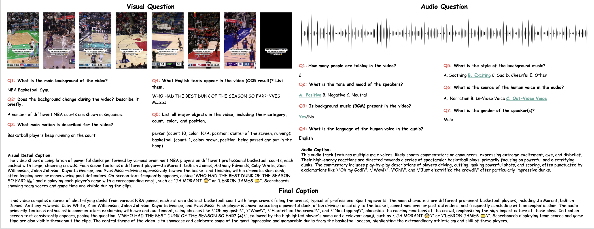
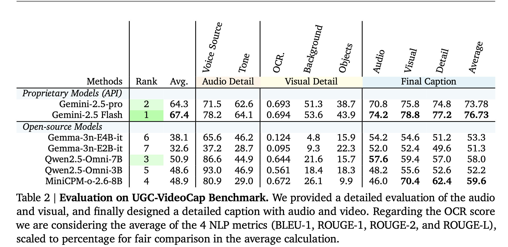

# UGC-VideoCaptioner: An Omni UGC Video Detail Caption Model and New Benchmarks


<p align="center">
  <a href="https://memories.ai/" target="_blank">
    
  </a> 
  <!-- <a href="https://arxiv.org/pdf/2503.12542v2" target='_**blank**'>
    
  </a>  -->
  <a href="https://huggingface.co/collections/openinterx/ugc-videocap-6845e290580112a1834737c4" target='_blank'>
    
  </a>
</p>

<p align="center">
    
</p>

## Benchmark Results

<p align="center">
    
</p>


## Model Zoom

| Model                         | visual | audio | details | average | Link |
|:------------------------------|:------:|:-----:|:-------:|:-------:|:----:|
| Gemini-2.5-pro              |    75.8    |   70.8    |    74.8     |     73.78    | N/A  |
| Gemini-2.5-flash              | **78.8**     |   **74.2**    |    **77.2**    |    **76.73**    | N/A  |
| Qwen2.5-Omni-3B               |   55.6     |  48.2    |   52.6      |   52.18      | N/A  |
| UGC-VideoCaptioner-3B-zero(1k RL)         |    57.8    |  53.0     |    55.4     |    55.40(**+3.22**)    | [google-drive](https://drive.google.com/drive/folders/1R-L4kz4R7UxYpcU4El1ctgvVDQbsMsG6?usp=sharing) |
| Qwen2.5-Omni-3B 1k sft        |    58.4    |   61.4  |   57.0    |     58.96(+6.78)    | [google-drive](https://drive.google.com/drive/folders/1itJ1u4XEJNVfmgbxuKL-fGWCbaW3EAza?usp=sharing) |
| Qwen2.5-Omni-3B 10k sft       |    58.4   |    63.2   |   58.0     |   59.87(+7.69)     | [google-drive](https://drive.google.com/drive/folders/1auQ4mx9CcxIzAIF4SyH034xufzrqe29w?usp=sharing) |
| Qwen2.5-Omni-3B 20k sft       |    59.2   |   64    |    58.4   |     60.50(+8.32)     | [google-drive](https://drive.google.com/drive/folders/11WJZkq8I_807zJUmBCCvwNjSj18F2im9?usp=sharing) |
| UGC-VideoCaptioner-3B (1k SFT + 1k RL)         |   59.4     |    62.4   |    58.2     |    60.01(**+7.83**)   | [google-drive](https://drive.google.com/drive/folders/1LGmIU60cdacErNgUk86D8I5_kiU_ljFz?usp=sharing) |


## Benchmark inference(for UGC-VideoCaptioner-3B & Qwen2.5-Omni)
env
```bash
conda create -n test python=3.12
pip install vllm
pip install transformers==4.52.3
```


```python
from vllm.assets.video import VideoAsset
```
**change the source code in vllm. open the VideoAsset function file and replace the video.py**


```bash
cd omni_bench_inference

CUDA_VISIBLE_DEVICES=0 \
VLLM_USE_V1=0 \
python vllm_infer.py
```


## Evaluation 
### Final Caption

**judge by gpt-4o-2024-08-06**

This version of model was posted before the tikitok video. 

```bash
python eval_caption.py
```